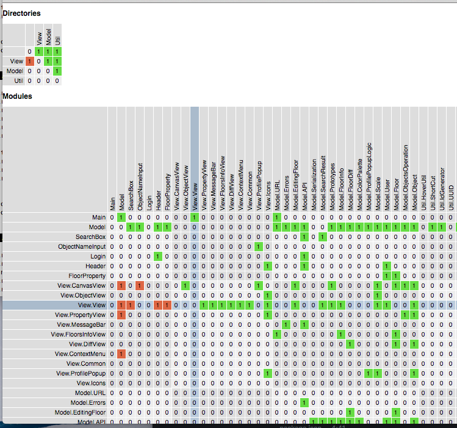

# elm-dep-check

Visualizing module dependencies of Elm projects.



## Features

* Visualize dependencies among modules/directories
* Detect circular dependencies among directories

Circular module dependencies are detected by Elm compiler, but in general, it also makes your project healthy to keep directory dependencies unidirectional!

It is also good to check your project's local rules are observed (e.g. `View.*` should not be used by `Model.*`).


## Install

```
npm install -g elm-dep-check
```

## Usage

Go to your project directory and use this command.

```
elm-dep-check
```

This creates `dep-check.html` in the current directory.


## LICENSE

BSD3
